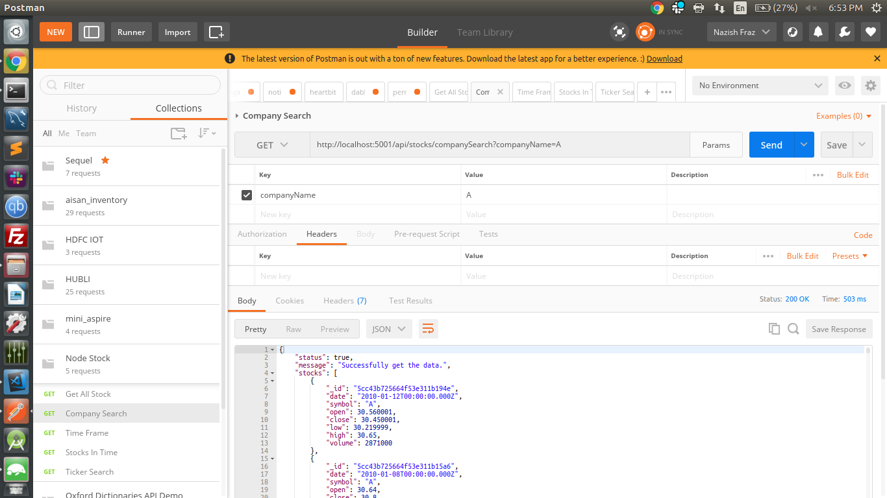
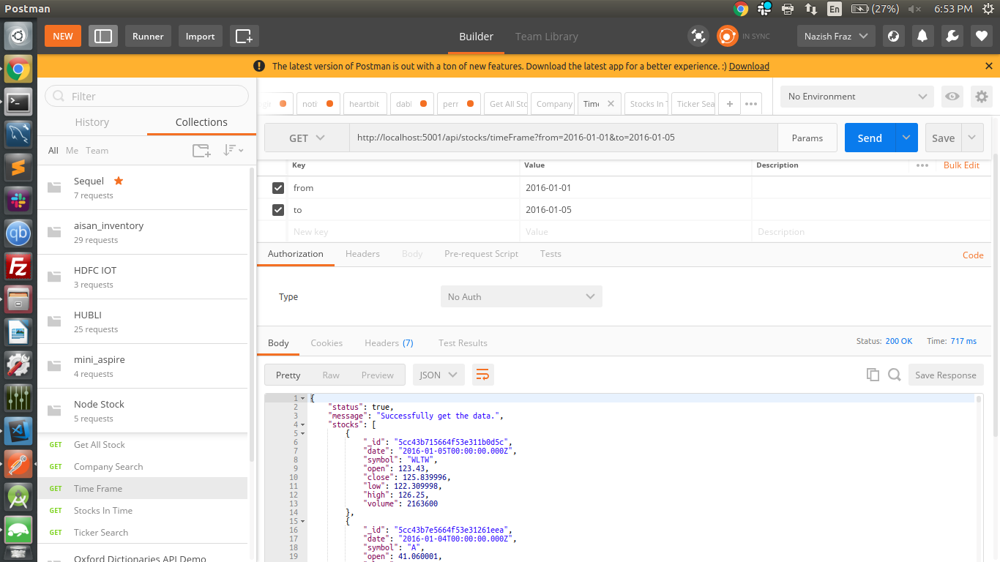
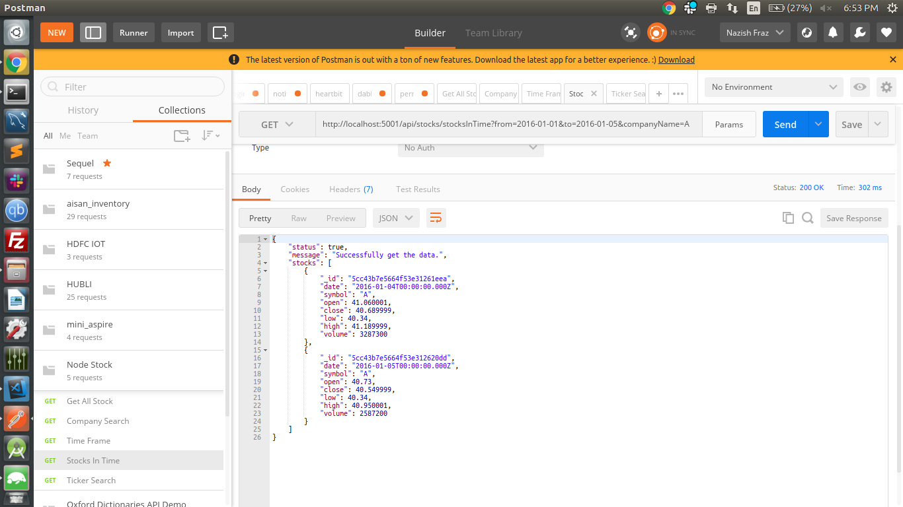
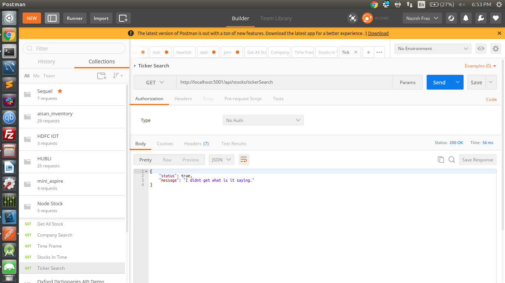

# Stock Data Repo

### [Problem Statement]

Develop a pseudo backend Application for Stock Data Repo. A data dump is provided which contains the stocks related historical data from 2005 - 2016. Your web app should be an archive of historical stocks trading data. Users should be able to fetch history of desired stock prices using APIs you expose.

### [Ideal Behaviour]

* Write a backend which exports APIs with all the data provided in the dump below.
* Implement multiple APIs for validation of the request and retrieval of data.
* Your APIs should take multiple parameters to fetch data from backend, performs API key validation and other request validations.

### [Minimum Requirement]

* Write a backend in tech stack mentioned below which exposes APIs which return response in JSON.
* Implement an API key validation.
* Implement APIs for:

> companySearch: This service should take a company name and returns all the price points of that company over the entire duration.

> timeFrame: This service should take two dates as input and should return 10 best performing and 10 least performing stocks in that time frame.

> stocksInTime: This service should accept two parameters, “any number of stock tickers in a list” and “two dates”. This will return all the highs, lows and closes of these stocks in the desired time frame.

> tickerSearch: This service should take the ticker symbol and should return all the price points in time of that ticker.

 

* Data APIs should be called internally after validation of incoming requests.
* Implement Postman collection for your APIs documentation.
* Zip all your source code, deployment instructions, screenshots and upload them.

### [Extra Work]

Along with everything from the above level :

* Implement ORM Mongoose for data modeling in the backend.
* Perform thorough Unit Tests and submit a report.
* Write a script to test and deploy your backend.
* Use your imagination and add features which would make things easier for end users.
* Zip all your source code, executables(if any, viz. war file), deployment instruction, db dump file, screenshots and upload them.

### [Guide]

Stock Archives Data dump: http://hck.re/CPKVPp
Stocks info Xlsx files: http://hck.re/oUVSlU

### [Ideal Stack]
Backend : NodeJS - Express, Golang, ORM Mongoose
Db : MongoDB

### [Installation Process]

* clone the github repo [Link](https://github.com/nfraz007/node_stock.git)
* start mongodb by running this command "sudo service mongod start"
* import the csv file in mongodb, name the database as "node_stock" and collection name as "stocks", and import it.
* now open the terminal and goto the root folder of the project and run "npm run dev" make sure you have installed nodejs locally. It will start a local server in 5001 port.
* Open Postman application, and import the collection from postman folder which is in json format
* Now check for output for each API

### Snapshot
* for company search api

* for time frame api

* for stock in time api

* for ticker api
